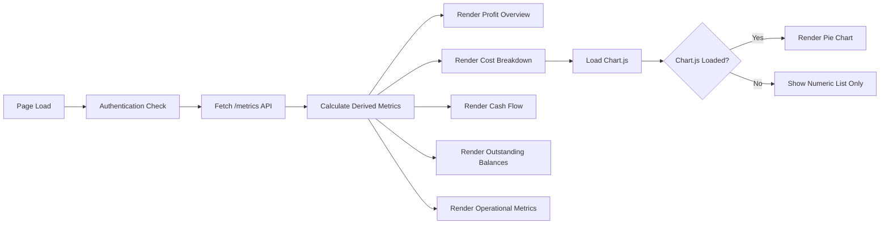

# Design Document: Financial Dashboard Redesign

## Overview

The Financial Dashboard Redesign transforms the existing dashboard into a decision-focused interface that provides business owners with immediate, actionable insights into company financial health. The redesign prioritizes answering four critical business questions:

1. **Are we making money?** (Profit Overview)
2. **Where is our money going?** (Cost Distribution)
3. **How much cash actually moved?** (Cash Flow Analysis)
4. **Who owes what?** (Outstanding Balances)

The design maintains the existing Arabic RTL interface, authentication flow, and styling system while reorganizing the financial data presentation to emphasize clarity and decision-making over raw data display.

### Design Goals

- Transform raw financial metrics into actionable business insights
- Establish clear visual hierarchy with profit metrics most prominent
- Provide visual cost distribution through Chart.js pie chart
- Distinguish between accrual-based profit and cash-based liquidity
- Enable quick assessment of receivables and payables
- Maintain responsive design across desktop, tablet, and mobile devices
- Preserve existing authentication, styling, and navigation systems

### Key Design Decisions

1. **Hierarchical Layout**: Profit overview at top (largest cards), followed by cost breakdown, cash flow, outstanding balances, and operational metrics in descending visual prominence
2. **Chart.js Integration**: Load from CDN with graceful degradation to numeric list if loading fails
3. **Color Semantics**: Green for positive/incoming money, red for negative/outgoing money, neutral for informational metrics
4. **Calculation Strategy**: Derive all metrics client-side from /metrics API response to minimize backend changes
5. **Progressive Enhancement**: Core functionality works without Chart.js; chart enhances the experience

## Architecture

### System Context

```mermaid
graph TB
    User[Business Owner] --> Dashboard[Financial Dashboard]
    Dashboard --> MetricsAPI[/metrics API Endpoint]
    Dashboard --> ChartCDN[Chart.js CDN]
    Dashboard --> Utils[Utility Functions]
    
    MetricsAPI --> Backend[Backend Server]
    Utils --> FormatCurrency[formatCurrency]
    Utils --> ApiGet[apiGet]
    Utils --> FormatDate[formatDate]
    
    Dashboard --> Auth[Authentication Manager]
    Auth --> Backend
```

### Component Architecture

The dashboard follows a client-side rendering architecture with these layers:

1. **Data Layer**: Fetches financial metrics from /metrics API endpoint
2. **Calculation Layer**: Derives additional metrics (Net Profit, Net Cash Flow, Outstanding Balances)
3. **Presentation Layer**: Renders sections with appropriate visual hierarchy and color coding
4. **Visualization Layer**: Renders Chart.js pie chart for cost distribution



## Components and Interfaces

### 1. Profit Overview Section

**Purpose**: Answer "Are we making money?" at a glance

**Visual Design**:
- Three large metric cards displayed horizontally
- Positioned at the top of the dashboard
- Larger font sizes than other sections (2.5rem for values)
- Net Profit uses color coding (green if positive, red if negative)

**Metrics**:
- **Total Revenue**: Sum of all income from client entries
- **Total Costs**: Sum of Crushers + Suppliers + Contractors + Employees + Administrative + Expenses + Losses
- **Net Profit**: Total Revenue - Total Costs

**HTML Structure**:
```html
<section class="profit-overview-section">
  <div class="profit-cards-grid">
    <div class="profit-card">
      <div class="profit-icon">💰</div>
      <div class="profit-value">{formatted_revenue}</div>
      <div class="profit-label">إجمالي الإيرادات</div>
    </div>
    <div class="profit-card">
      <div class="profit-icon">📊</div>
      <div class="profit-value">{formatted_costs}</div>
      <div class="profit-label">إجمالي التكاليف</div>
    </div>
    <div class="profit-card">
      <div class="profit-icon">📈</div>
      <div class="profit-value profit-value-{positive|negative}">{formatted_net_profit}</div>
      <div class="profit-label">صافي الربح</div>
    </div>
  </div>
</section>
```

**Calculation Logic**:
```javascript
const totalRevenue = metrics.totalSales || 0;
const totalCosts = (metrics.totalCrusherCosts || 0) +
                   (metrics.totalSupplierCosts || 0) +
                   (metrics.totalContractorCosts || 0) +
                   (metrics.totalEmployeeCosts || 0) +
                   (metrics.totalAdministrationCosts || 0) +
                   (metrics.totalExpenses || 0) +
                   (metrics.totalLosses || 0);
const netProfit = totalRevenue - totalCosts;
```

### 2. Final Financial Result Card

**Purpose**: Provide comprehensive summary of true financial state combining operating profit, expenses, and outstanding balances

**Visual Design**:
- Single prominent card positioned below Profit Overview Section
- Displays 5 key financial metrics in a structured layout
- Color coding: Green for profit, Red for loss, Neutral for informational values
- Clear visual separation between sections with divider lines
- Larger than regular metric cards but smaller than profit overview cards

**Metrics**:
- **Operating Result**: Total Revenue - Operational Costs (Crushers, Suppliers, Contractors, Employees)
- **Expenses**: Administrative + Office + Miscellaneous expenses
- **Net Profit/Loss**: Operating Result - Expenses
- **Outstanding Client Due**: Total Revenue - Total Client Payments
- **Profit Before Payment**: Net Profit/Loss + Outstanding Client Due

**HTML Structure**:
```html
<section class="final-result-section">
  <div class="final-result-card">
    <div class="final-result-header">
      <h2 class="final-result-title">النتيجة المالية النهائية</h2>
    </div>
    
    <div class="final-result-body">
      <div class="final-result-row">
        <span class="result-label">نتيجة التشغيل</span>
        <span class="result-value result-neutral">{formatted_operating_result}</span>
      </div>
      
      <div class="final-result-row">
        <span class="result-label">المصروفات</span>
        <span class="result-value result-neutral">{formatted_expenses}</span>
      </div>
      
      <div class="final-result-divider"></div>
      
      <div class="final-result-row highlight">
        <span class="result-label">صافي الربح / الخسارة</span>
        <span class="result-value result-{positive|negative}">{formatted_net_profit_loss}</span>
      </div>
      
      <div class="final-result-row">
        <span class="result-label">مستحقات العملاء</span>
        <span class="result-value result-neutral">{formatted_total_due}</span>
      </div>
      
      <div class="final-result-divider"></div>
      
      <div class="final-result-row highlight">
        <span class="result-label">الربح قبل استلام المدفوعات</span>
        <span class="result-value result-{positive|negative}">{formatted_profit_before_payment}</span>
      </div>
    </div>
  </div>
</section>
```

**Calculation Logic**:
```javascript
// 1. Net Operating Result
const totalRevenue = metrics.totalSales || 0;
const operationalCosts = (metrics.totalCrusherCosts || 0) +
                        (metrics.totalSupplierCosts || 0) +
                        (metrics.totalContractorCosts || 0) +
                        (metrics.totalEmployeeCosts || 0);
const netOperatingResult = totalRevenue - operationalCosts;

// 2. Total Expenses
const totalExpenses = (metrics.totalAdministrationCosts || 0) +
                     (metrics.operatingExpenses || 0) +
                     (metrics.totalLosses || 0);

// 3. Net Profit/Loss
const netProfitLoss = netOperatingResult - totalExpenses;

// 4. Total Due (Outstanding Balance)
const totalClientPayments = metrics.totalClientPayments || 0;
const totalDue = totalRevenue - totalClientPayments;

// 5. Profit Before Payment
const profitBeforePayment = totalDue + netProfitLoss;
```

**CSS Styling**:
```css
.final-result-section {
  margin-bottom: var(--space-8);
}

.final-result-card {
  background: white;
  border-radius: var(--radius-xl);
  box-shadow: var(--shadow-lg);
  border: 2px solid var(--primary-200);
  overflow: hidden;
}

.final-result-header {
  background: linear-gradient(135deg, var(--primary-600) 0%, var(--primary-800) 100%);
  color: white;
  padding: var(--space-6);
  text-align: center;
}

.final-result-title {
  font-size: 1.5rem;
  font-weight: 700;
  margin: 0;
}

.final-result-body {
  padding: var(--space-6);
}

.final-result-row {
  display: flex;
  justify-content: space-between;
  align-items: center;
  padding: var(--space-4) 0;
}

.final-result-row.highlight {
  font-weight: 600;
  font-size: 1.125rem;
}

.result-label {
  color: var(--gray-700);
}

.result-value {
  font-size: 1.25rem;
  font-weight: 600;
}

.result-value.result-positive {
  color: var(--success-600);
}

.result-value.result-negative {
  color: var(--danger-600);
}

.result-value.result-neutral {
  color: var(--gray-900);
}

.final-result-divider {
  height: 2px;
  background: var(--gray-200);
  margin: var(--space-4) 0;
}
```

**User Experience Goals**:
The Final Financial Result Card enables users to answer these questions in under 5 seconds:
1. Are we profitable? (Net Profit/Loss)
2. How much money do clients still owe us? (Outstanding Client Due)
3. Are expenses hurting profit? (Compare Operating Result vs Net Profit/Loss)
4. What would profit be if all payments were received? (Profit Before Payment)

### 3. Cost Breakdown Section

**Purpose**: Answer "Where is our money going?" through visual distribution

**Visual Design**:
- Two-column layout: Pie chart on right (RTL), numeric list on left
- Chart uses distinct colors for each cost category
- Numeric list shows category name and formatted amount
- Falls back to numeric list only if Chart.js fails to load

**Cost Categories**:
1. Employees (موظفين)
2. Contractors (مقاولين)
3. Crushers (كسارات)
4. Suppliers (موردين)
5. Administrative (إدارية)
6. Expenses (مصروفات)
7. Losses (خسائر)

**HTML Structure**:
```html
<section class="cost-breakdown-section">
  <h2 class="section-title">توزيع التكاليف</h2>
  <div class="cost-breakdown-grid">
    <div class="cost-chart-container">
      <canvas id="costPieChart"></canvas>
    </div>
    <div class="cost-list">
      <div class="cost-item">
        <span class="cost-category">موظفين</span>
        <span class="cost-amount">{formatted_amount}</span>
      </div>
      <!-- Repeat for each category -->
    </div>
  </div>
</section>
```

**Chart.js Configuration**:
```javascript
// Load Chart.js from CDN
const chartScript = document.createElement('script');
chartScript.src = 'https://cdn.jsdelivr.net/npm/chart.js';
chartScript.onload = () => renderCostChart(costData);
chartScript.onerror = () => console.warn('Chart.js failed to load, showing numeric list only');

function renderCostChart(costData) {
  const ctx = document.getElementById('costPieChart').getContext('2d');
  new Chart(ctx, {
    type: 'pie',
    data: {
      labels: costData.labels,
      datasets: [{
        data: costData.values,
        backgroundColor: [
          '#3B82F6', // Blue - Employees
          '#10B981', // Green - Contractors
          '#F59E0B', // Amber - Crushers
          '#8B5CF6', // Purple - Suppliers
          '#EC4899', // Pink - Administrative
          '#EF4444', // Red - Expenses
          '#6B7280'  // Gray - Losses
        ]
      }]
    },
    options: {
      responsive: true,
      plugins: {
        legend: {
          position: 'bottom',
          rtl: true,
          textDirection: 'rtl'
        }
      }
    }
  });
}
```

### 4. Cash Flow Section

**Purpose**: Answer "How much cash actually moved?" to understand liquidity

**Visual Design**:
- Two-column layout: Money In (right) and Money Out (left)
- Each column lists specific cash movements
- Net Cash Flow displayed prominently at bottom with color coding
- Green for positive net cash flow, red for negative

**Metrics**:

**Money In**:
- Client Payments (actual cash received)
- Positive Client Adjustments

**Money Out**:
- Supplier Payments
- Crusher Payments
- Contractor Payments
- Employee Payments
- Expenses
- Administrative Costs

**Net Cash Flow**: Money In - Money Out

**HTML Structure**:
```html
<section class="cash-flow-section">
  <h2 class="section-title">حركة النقد</h2>
  <div class="cash-flow-grid">
    <div class="cash-flow-column money-in">
      <h3 class="column-title">النقد الداخل</h3>
      <div class="cash-flow-items">
        <div class="cash-flow-item">
          <span class="item-label">مدفوعات العملاء</span>
          <span class="item-value">{formatted_amount}</span>
        </div>
        <!-- More items -->
      </div>
      <div class="cash-flow-total">
        <span>إجمالي النقد الداخل</span>
        <span class="total-value">{formatted_total}</span>
      </div>
    </div>
    
    <div class="cash-flow-column money-out">
      <h3 class="column-title">النقد الخارج</h3>
      <div class="cash-flow-items">
        <!-- Similar structure -->
      </div>
      <div class="cash-flow-total">
        <span>إجمالي النقد الخارج</span>
        <span class="total-value">{formatted_total}</span>
      </div>
    </div>
  </div>
  
  <div class="net-cash-flow">
    <span class="net-label">صافي حركة النقد</span>
    <span class="net-value net-value-{positive|negative}">{formatted_net}</span>
  </div>
</section>
```

**Calculation Logic**:
```javascript
const moneyIn = (metrics.totalClientPayments || 0) +
                (metrics.positiveClientAdjustments || 0);

const moneyOut = (metrics.totalSupplierPayments || 0) +
                 (metrics.totalCrusherPayments || 0) +
                 (metrics.totalContractorPayments || 0) +
                 (metrics.totalEmployeePayments || 0) +
                 (metrics.totalExpenses || 0) +
                 (metrics.totalAdministrationCosts || 0);

const netCashFlow = moneyIn - moneyOut;
```

### 5. Outstanding Balances Section

**Purpose**: Answer "Who owes what?" for receivables and payables management

**Visual Design**:
- Two-panel layout: "Money Owed To Us" (right) and "Money We Owe" (left)
- Money Owed To Us uses green color indicator
- Money We Owe uses red color indicator
- Each panel shows total amount and breakdown by entity type

**Metrics**:

**Money Owed To Us**:
- Outstanding client balances (positive balances)
- Total displayed with green indicator

**Money We Owe**:
- Outstanding supplier balances
- Outstanding crusher balances
- Outstanding contractor balances
- Outstanding employee balances
- Total displayed with red indicator

**HTML Structure**:
```html
<section class="outstanding-balances-section">
  <h2 class="section-title">الأرصدة المستحقة</h2>
  <div class="balances-grid">
    <div class="balance-panel owed-to-us">
      <div class="panel-header">
        <span class="panel-icon">💵</span>
        <h3 class="panel-title">مستحقات لنا</h3>
      </div>
      <div class="panel-total balance-positive">
        {formatted_total}
      </div>
      <div class="panel-breakdown">
        <div class="breakdown-item">
          <span>أرصدة العملاء</span>
          <span>{formatted_amount}</span>
        </div>
      </div>
    </div>
    
    <div class="balance-panel we-owe">
      <div class="panel-header">
        <span class="panel-icon">💳</span>
        <h3 class="panel-title">مستحقات علينا</h3>
      </div>
      <div class="panel-total balance-negative">
        {formatted_total}
      </div>
      <div class="panel-breakdown">
        <div class="breakdown-item">
          <span>موردين</span>
          <span>{formatted_amount}</span>
        </div>
        <!-- More items -->
      </div>
    </div>
  </div>
</section>
```

**Calculation Logic**:
```javascript
// Money owed to us (positive client balances)
const moneyOwedToUs = metrics.totalClientBalancesPositive || 0;

// Money we owe (sum of all negative balances)
const moneyWeOwe = (metrics.totalSupplierBalances || 0) +
                   (metrics.totalCrusherBalances || 0) +
                   (metrics.totalContractorBalances || 0) +
                   (Math.abs(metrics.totalEmployeeBalancesNegative || 0));
```

### 6. Operational Metrics Section

**Purpose**: Provide context on operational scale

**Visual Design**:
- Grid of smaller cards (smaller than profit cards)
- Neutral color indicators (no green/red)
- Icons for each entity type
- Positioned at bottom of dashboard

**Metrics**:
- Total Employees (👥)
- Total Clients (🏢)
- Total Crushers (🏭)
- Total Suppliers (📦)
- Total Contractors (🚛)
- Total Projects (📋)
- Total Entries (📝)

**HTML Structure**:
```html
<section class="operational-metrics-section">
  <h2 class="section-title">المقاييس التشغيلية</h2>
  <div class="operational-grid">
    <div class="operational-card">
      <div class="operational-icon">👥</div>
      <div class="operational-value">{count}</div>
      <div class="operational-label">إجمالي الموظفين</div>
    </div>
    <!-- Repeat for each metric -->
  </div>
</section>
```

### 7. Data Fetching Component

**Purpose**: Centralized data loading with error handling

**Interface**:
```javascript
async function loadDashboardData() {
  // Check authentication
  if (!authManager.isAuthenticated()) {
    window.location.href = '/login.html';
    return;
  }
  
  try {
    // Fetch metrics from API
    const metrics = await apiGet('/metrics');
    
    // Render all sections
    renderProfitOverview(metrics);
    renderFinalFinancialResult(metrics);
    renderCostBreakdown(metrics);
    renderCashFlow(metrics);
    renderOutstandingBalances(metrics);
    renderOperationalMetrics(metrics);
    
    // Update last refresh time
    updateLastRefreshTime();
  } catch (error) {
    console.error('Error loading dashboard data:', error);
    showErrorMessage('خطأ في تحميل البيانات المالية');
  }
}
```

**Error Handling**:
- Authentication failure: Redirect to login page
- API failure: Display error message in affected section
- Chart.js load failure: Show numeric list only
- Partial data: Display available data, show placeholder for missing data

## Data Models

### Metrics API Response

The /metrics API endpoint returns aggregated financial data:

```typescript
interface MetricsResponse {
  // Revenue metrics
  totalSales: number;
  totalEarnedSalary: number;
  
  // Cost metrics
  totalCrusherCosts: number;
  totalSupplierCosts: number;
  totalContractorCosts: number;
  totalEmployeeCosts: number;
  totalAdministrationCosts: number;
  totalExpenses: number;
  totalLosses: number;
  
  // Cash flow metrics
  totalClientPayments: number;
  positiveClientAdjustments: number;
  totalSupplierPayments: number;
  totalCrusherPayments: number;
  totalContractorPayments: number;
  totalEmployeePayments: number;
  totalCashPayments: number;
  
  // Balance metrics
  totalClientBalancesPositive: number;
  totalClientBalancesNegative: number;
  totalSupplierBalances: number;
  totalCrusherBalances: number;
  totalContractorBalances: number;
  totalEmployeeBalancesNegative: number;
  
  // Operational metrics
  totalEmployees: number;
  totalClients: number;
  totalCrushers: number;
  totalSuppliers: number;
  totalContractors: number;
  totalProjects: number;
  totalDeliveries: number;
  
  // Derived metrics (calculated on backend)
  netProfit: number;
  operatingExpenses: number;
  totalCapitalInjected: number;
}
```

### Derived Metrics (Client-Side Calculations)

```typescript
interface DerivedMetrics {
  // Profit calculations
  totalRevenue: number;        // totalSales
  totalCosts: number;          // Sum of all cost categories
  netProfit: number;           // totalRevenue - totalCosts
  
  // Cash flow calculations
  moneyIn: number;             // totalClientPayments + positiveClientAdjustments
  moneyOut: number;            // Sum of all payment categories
  netCashFlow: number;         // moneyIn - moneyOut
  
  // Balance calculations
  moneyOwedToUs: number;       // totalClientBalancesPositive
  moneyWeOwe: number;          // Sum of all negative balances
  netOutstanding: number;      // moneyOwedToUs - moneyWeOwe
}
```

### Cost Distribution Data Structure

```typescript
interface CostDistribution {
  labels: string[];            // Arabic category names
  values: number[];            // Cost amounts
  colors: string[];            // Chart colors
  total: number;               // Sum of all costs
}

// Example:
const costDistribution = {
  labels: ['موظفين', 'مقاولين', 'كسارات', 'موردين', 'إدارية', 'مصروفات', 'خسائر'],
  values: [50000, 30000, 40000, 25000, 15000, 10000, 5000],
  colors: ['#3B82F6', '#10B981', '#F59E0B', '#8B5CF6', '#EC4899', '#EF4444', '#6B7280'],
  total: 175000
};
```

### UI State Model

```typescript
interface DashboardState {
  isLoading: boolean;
  hasError: boolean;
  errorMessage: string;
  lastRefreshTime: Date;
  chartJsLoaded: boolean;
  metrics: MetricsResponse | null;
  derivedMetrics: DerivedMetrics | null;
}
```

### Responsive Breakpoints

```typescript
interface ResponsiveBreakpoints {
  mobile: '0-700px';      // Single column layout
  tablet: '701-1024px';   // Two column layout
  desktop: '1025px+';     // Multi-column layout
}
```

### Color Coding System

```typescript
interface ColorIndicators {
  positive: {
    text: 'var(--success-600)',      // #10B981
    background: 'var(--success-50)',  // Light green
    border: 'var(--success-200)'
  };
  negative: {
    text: 'var(--danger-600)',        // #EF4444
    background: 'var(--danger-50)',   // Light red
    border: 'var(--danger-200)'
  };
  neutral: {
    text: 'var(--gray-900)',          // Dark gray
    background: 'var(--gray-50)',     // Light gray
    border: 'var(--gray-200)'
  };
}
```


## Correctness Properties

*A property is a characteristic or behavior that should hold true across all valid executions of a system—essentially, a formal statement about what the system should do. Properties serve as the bridge between human-readable specifications and machine-verifiable correctness guarantees.*

### Property 1: Total Revenue Calculation

*For any* metrics data object, when calculating Total Revenue, the result should equal the sum of all income from client entries (totalSales field).

**Validates: Requirements 1.2**

### Property 2: Total Costs Calculation

*For any* metrics data object with cost fields (Crushers, Suppliers, Contractors, Employees, Administrative, Expenses, Losses), when calculating Total Costs, the result should equal the sum of all seven cost categories.

**Validates: Requirements 1.3**

### Property 3: Net Profit Calculation

*For any* Total Revenue value and Total Costs value, when calculating Net Profit, the result should equal Total Revenue minus Total Costs.

**Validates: Requirements 1.4**

### Property 4: Net Profit Color Coding

*For any* Net Profit value, the displayed color indicator should be green when the value is positive or zero, and red when the value is negative.

**Validates: Requirements 1.5, 1.6**

### Property 5: Money In Calculation

*For any* metrics data object, when calculating Money In, the result should equal the sum of Client Payments and positive Client Adjustments.

**Validates: Requirements 3.2**

### Property 6: Money Out Calculation

*For any* metrics data object with payment fields (Supplier Payments, Crusher Payments, Contractor Payments, Employee Payments, Expenses, Administrative Costs), when calculating Money Out, the result should equal the sum of all six payment categories.

**Validates: Requirements 3.3**

### Property 7: Net Cash Flow Calculation

*For any* Money In value and Money Out value, when calculating Net Cash Flow, the result should equal Money In minus Money Out.

**Validates: Requirements 3.4**

### Property 8: Net Cash Flow Color Coding

*For any* Net Cash Flow value, the displayed color indicator should be green when the value is positive or zero, and red when the value is negative.

**Validates: Requirements 3.5, 3.6**

### Property 9: Money Owed To Us Calculation

*For any* collection of client balance values, when calculating Money Owed To Us, the result should equal the sum of all positive client balances.

**Validates: Requirements 4.4**

### Property 10: Money We Owe Calculation

*For any* collection of balance values across Suppliers, Crushers, Contractors, and Employees, when calculating Money We Owe, the result should equal the sum of all negative balances (taking absolute values).

**Validates: Requirements 4.5**

### Property 11: Net Operating Result Calculation

*For any* metrics data object with Total Revenue and Operational Costs (Crushers, Suppliers, Contractors, Employees), when calculating Net Operating Result, the result should equal Total Revenue minus the sum of all four operational cost categories.

**Validates: Requirements 10.2**

### Property 12: Net Profit/Loss Calculation (Final Result)

*For any* Net Operating Result value and Total Expenses value, when calculating Net Profit/Loss in the Final Financial Result Card, the result should equal Net Operating Result minus Total Expenses.

**Validates: Requirements 10.4**

### Property 13: Total Due Calculation

*For any* Total Revenue value and Total Client Payments value, when calculating Total Due, the result should equal Total Revenue minus Total Client Payments.

**Validates: Requirements 10.5**

### Property 14: Profit Before Payment Calculation

*For any* Net Profit/Loss value and Total Due value, when calculating Profit Before Payment, the result should equal Net Profit/Loss plus Total Due.

**Validates: Requirements 10.6**

### Property 15: Net Profit/Loss Color Coding (Final Result)

*For any* Net Profit/Loss value in the Final Financial Result Card, the displayed color indicator should be green when the value is positive or zero, and red when the value is negative.

**Validates: Requirements 10.8, 10.9**

### Property 16: Profit Before Payment Color Coding

*For any* Profit Before Payment value, the displayed color indicator should be green when the value is positive or zero, and red when the value is negative.

**Validates: Requirements 10.10, 10.11**

## Error Handling

### Error Categories

The dashboard implements comprehensive error handling across multiple failure points:

#### 1. Authentication Errors

**Scenario**: User is not authenticated or session has expired

**Handling**:
```javascript
if (!authManager.isAuthenticated()) {
  window.location.href = '/login.html';
  return;
}
```

**User Experience**: Automatic redirect to login page with no error message (standard authentication flow)

#### 2. API Request Errors

**Scenario**: /metrics API endpoint fails to respond or returns error

**Handling**:
```javascript
try {
  const metrics = await apiGet('/metrics');
  // Process metrics
} catch (error) {
  console.error('Error loading dashboard data:', error);
  showErrorMessage('خطأ في تحميل البيانات المالية');
}
```

**User Experience**: 
- Error message displayed in Arabic: "خطأ في تحميل البيانات المالية"
- Error styling with red background and border
- Console logging for debugging
- Dashboard remains functional with empty/placeholder state

#### 3. Chart.js CDN Load Failure

**Scenario**: Chart.js fails to load from CDN (network issue, CDN down, blocked)

**Handling**:
```javascript
const chartScript = document.createElement('script');
chartScript.src = 'https://cdn.jsdelivr.net/npm/chart.js';
chartScript.onload = () => renderCostChart(costData);
chartScript.onerror = () => {
  console.warn('Chart.js failed to load, showing numeric list only');
  // Numeric list already rendered, no additional action needed
};
```

**User Experience**:
- Graceful degradation: numeric cost list displays without pie chart
- No error message shown (degradation is transparent)
- Full functionality maintained through numeric display
- Console warning for debugging

#### 4. Missing or Invalid Data

**Scenario**: API returns data with missing fields or unexpected values

**Handling**:
```javascript
const totalRevenue = metrics.totalSales || 0;
const totalCosts = (metrics.totalCrusherCosts || 0) +
                   (metrics.totalSupplierCosts || 0) +
                   // ... other fields with || 0 fallback
```

**User Experience**:
- Default to zero for missing numeric fields
- Calculations proceed with available data
- No error message (partial data is acceptable)
- formatCurrency handles null/undefined gracefully

#### 5. Utility Function Unavailability

**Scenario**: Utility functions (formatCurrency, apiGet) not loaded

**Handling**:
```javascript
if (typeof apiGet === 'undefined') {
  console.error('API utilities not loaded');
  showErrorMessage('فشل في تحميل أدوات النظام');
  return;
}
```

**User Experience**:
- Error message in Arabic: "فشل في تحميل أدوات النظام"
- Dashboard does not attempt to load data
- Clear indication of system-level failure

### Error Recovery Strategies

#### Retry Mechanism

For transient network errors, implement manual retry:

```javascript
<button onclick="loadDashboardData()">🔄 تحديث البيانات</button>
```

Users can manually retry data loading without page refresh.

#### Partial Rendering

If some sections fail to load, others continue to display:

```javascript
// Each section has independent error handling
try {
  renderProfitOverview(metrics);
} catch (error) {
  console.error('Error rendering profit overview:', error);
  // Other sections still render
}
```

#### Fallback Values

All calculations use fallback values to prevent NaN or undefined:

```javascript
const value = metrics.someField || 0;  // Fallback to 0
const formatted = formatCurrency(value);  // Always produces valid output
```

### Error Logging

All errors are logged to console with context:

```javascript
console.error('Error loading dashboard data:', error);
console.warn('Chart.js failed to load, showing numeric list only');
```

This enables debugging in production without exposing technical details to users.

### User-Facing Error Messages

All error messages are in Arabic and user-friendly:

- "خطأ في تحميل البيانات المالية" (Error loading financial data)
- "فشل في تحميل أدوات النظام" (Failed to load system utilities)

Error messages use consistent styling:
```css
.error {
  text-align: center;
  padding: var(--space-8);
  color: var(--danger-600);
  background: var(--danger-50);
  border-radius: var(--radius);
  border: 1px solid var(--danger-200);
}
```

## Testing Strategy

### Dual Testing Approach

The Financial Dashboard Redesign requires both unit testing and property-based testing to ensure comprehensive correctness:

**Unit Tests**: Verify specific examples, edge cases, DOM structure, and integration points
**Property Tests**: Verify universal calculation properties across all possible input values

Both testing approaches are complementary and necessary. Unit tests catch concrete bugs in specific scenarios, while property tests verify general correctness across the input space.

### Unit Testing

Unit tests focus on:

1. **DOM Structure Verification**
   - Verify three profit cards are rendered (Req 1.1)
   - Verify cost breakdown section contains all seven categories (Req 2.2)
   - Verify cash flow section has two columns (Req 3.1)
   - Verify outstanding balances section has two panels (Req 4.1)
   - Verify operational metrics section has seven cards (Req 5.1)
   - Verify section ordering: Profit → Cost → Cash Flow → Balances → Operational (Req 1.7, 2.6, 3.7, 4.6, 5.2)

2. **Chart.js Integration**
   - Verify Chart.js script tag is added with correct CDN URL (Req 2.4)
   - Verify pie chart renders when Chart.js loads successfully (Req 2.1)
   - Verify numeric list displays when Chart.js fails to load (Req 2.5)
   - Verify chart configuration includes RTL settings (Req 8.3)

3. **API Integration**
   - Verify apiGet is called with '/metrics' endpoint on load (Req 6.1)
   - Verify data populates all sections when API succeeds (Req 6.2)
   - Verify error message displays when API fails (Req 6.3)
   - Verify formatCurrency is called for all monetary values (Req 6.5)

4. **Responsive Design**
   - Verify multi-column layout at desktop breakpoint (>1024px) (Req 7.1)
   - Verify two-column layout at tablet breakpoint (701-1024px) (Req 7.2)
   - Verify single-column layout at mobile breakpoint (<700px) (Req 7.3)

5. **RTL Layout**
   - Verify dir="rtl" attribute on container elements (Req 8.1)
   - Verify CSS text-align and flex-direction for RTL (Req 8.2)
   - Verify sidebar.css and modern-theme.css are linked (Req 8.4)

6. **Visual Hierarchy**
   - Verify profit cards are larger than other cards (Req 9.1)
   - Verify primary metrics use larger font sizes (Req 9.2)
   - Verify sections have visual separation (margins/padding) (Req 9.3)
   - Verify appropriate icons are present for each metric type (Req 9.4)
   - Verify consistent card styling across sections (Req 9.5)

7. **Authentication Flow**
   - Verify authentication check before data load (Req 8.5)
   - Verify redirect to login when not authenticated

8. **Color Indicators**
   - Verify green color for positive money owed to us (Req 4.2)
   - Verify red color for money we owe (Req 4.3)
   - Verify neutral colors for operational metrics (Req 5.3)

9. **Edge Cases**
   - Zero values in all calculations
   - Missing fields in API response (fallback to 0)
   - Empty cost categories
   - All positive vs all negative balances

### Property-Based Testing

Property-based testing verifies universal calculation properties using randomized inputs. Each test should run a minimum of 100 iterations.

**Testing Library**: Use **fast-check** for JavaScript property-based testing

**Configuration**:
```javascript
import fc from 'fast-check';

// Run each property test with 100 iterations
fc.assert(
  fc.property(/* arbitraries */, /* test function */),
  { numRuns: 100 }
);
```

**Property Test Implementations**:

#### Property 1: Total Revenue Calculation
```javascript
// Feature: financial-dashboard-redesign, Property 1: For any metrics data object, when calculating Total Revenue, the result should equal the sum of all income from client entries (totalSales field).

fc.assert(
  fc.property(
    fc.float({ min: 0, max: 1000000 }), // totalSales
    (totalSales) => {
      const metrics = { totalSales };
      const result = calculateTotalRevenue(metrics);
      return result === totalSales;
    }
  ),
  { numRuns: 100 }
);
```

#### Property 2: Total Costs Calculation
```javascript
// Feature: financial-dashboard-redesign, Property 2: For any metrics data object with cost fields, when calculating Total Costs, the result should equal the sum of all seven cost categories.

fc.assert(
  fc.property(
    fc.record({
      totalCrusherCosts: fc.float({ min: 0, max: 100000 }),
      totalSupplierCosts: fc.float({ min: 0, max: 100000 }),
      totalContractorCosts: fc.float({ min: 0, max: 100000 }),
      totalEmployeeCosts: fc.float({ min: 0, max: 100000 }),
      totalAdministrationCosts: fc.float({ min: 0, max: 100000 }),
      totalExpenses: fc.float({ min: 0, max: 100000 }),
      totalLosses: fc.float({ min: 0, max: 100000 })
    }),
    (costs) => {
      const expectedSum = costs.totalCrusherCosts +
                         costs.totalSupplierCosts +
                         costs.totalContractorCosts +
                         costs.totalEmployeeCosts +
                         costs.totalAdministrationCosts +
                         costs.totalExpenses +
                         costs.totalLosses;
      const result = calculateTotalCosts(costs);
      return Math.abs(result - expectedSum) < 0.01; // Float comparison with epsilon
    }
  ),
  { numRuns: 100 }
);
```

#### Property 3: Net Profit Calculation
```javascript
// Feature: financial-dashboard-redesign, Property 3: For any Total Revenue value and Total Costs value, when calculating Net Profit, the result should equal Total Revenue minus Total Costs.

fc.assert(
  fc.property(
    fc.float({ min: 0, max: 1000000 }), // revenue
    fc.float({ min: 0, max: 1000000 }), // costs
    (revenue, costs) => {
      const expectedProfit = revenue - costs;
      const result = calculateNetProfit(revenue, costs);
      return Math.abs(result - expectedProfit) < 0.01;
    }
  ),
  { numRuns: 100 }
);
```

#### Property 4: Net Profit Color Coding
```javascript
// Feature: financial-dashboard-redesign, Property 4: For any Net Profit value, the displayed color indicator should be green when the value is positive or zero, and red when the value is negative.

fc.assert(
  fc.property(
    fc.float({ min: -1000000, max: 1000000 }), // netProfit (can be negative)
    (netProfit) => {
      const colorClass = getNetProfitColorClass(netProfit);
      if (netProfit >= 0) {
        return colorClass.includes('success') || colorClass.includes('green');
      } else {
        return colorClass.includes('danger') || colorClass.includes('red');
      }
    }
  ),
  { numRuns: 100 }
);
```

#### Property 5: Money In Calculation
```javascript
// Feature: financial-dashboard-redesign, Property 5: For any metrics data object, when calculating Money In, the result should equal the sum of Client Payments and positive Client Adjustments.

fc.assert(
  fc.property(
    fc.record({
      totalClientPayments: fc.float({ min: 0, max: 500000 }),
      positiveClientAdjustments: fc.float({ min: 0, max: 100000 })
    }),
    (metrics) => {
      const expectedSum = metrics.totalClientPayments + metrics.positiveClientAdjustments;
      const result = calculateMoneyIn(metrics);
      return Math.abs(result - expectedSum) < 0.01;
    }
  ),
  { numRuns: 100 }
);
```

#### Property 6: Money Out Calculation
```javascript
// Feature: financial-dashboard-redesign, Property 6: For any metrics data object with payment fields, when calculating Money Out, the result should equal the sum of all six payment categories.

fc.assert(
  fc.property(
    fc.record({
      totalSupplierPayments: fc.float({ min: 0, max: 100000 }),
      totalCrusherPayments: fc.float({ min: 0, max: 100000 }),
      totalContractorPayments: fc.float({ min: 0, max: 100000 }),
      totalEmployeePayments: fc.float({ min: 0, max: 100000 }),
      totalExpenses: fc.float({ min: 0, max: 100000 }),
      totalAdministrationCosts: fc.float({ min: 0, max: 100000 })
    }),
    (payments) => {
      const expectedSum = payments.totalSupplierPayments +
                         payments.totalCrusherPayments +
                         payments.totalContractorPayments +
                         payments.totalEmployeePayments +
                         payments.totalExpenses +
                         payments.totalAdministrationCosts;
      const result = calculateMoneyOut(payments);
      return Math.abs(result - expectedSum) < 0.01;
    }
  ),
  { numRuns: 100 }
);
```

#### Property 7: Net Cash Flow Calculation
```javascript
// Feature: financial-dashboard-redesign, Property 7: For any Money In value and Money Out value, when calculating Net Cash Flow, the result should equal Money In minus Money Out.

fc.assert(
  fc.property(
    fc.float({ min: 0, max: 500000 }), // moneyIn
    fc.float({ min: 0, max: 500000 }), // moneyOut
    (moneyIn, moneyOut) => {
      const expectedFlow = moneyIn - moneyOut;
      const result = calculateNetCashFlow(moneyIn, moneyOut);
      return Math.abs(result - expectedFlow) < 0.01;
    }
  ),
  { numRuns: 100 }
);
```

#### Property 8: Net Cash Flow Color Coding
```javascript
// Feature: financial-dashboard-redesign, Property 8: For any Net Cash Flow value, the displayed color indicator should be green when the value is positive or zero, and red when the value is negative.

fc.assert(
  fc.property(
    fc.float({ min: -500000, max: 500000 }), // netCashFlow (can be negative)
    (netCashFlow) => {
      const colorClass = getNetCashFlowColorClass(netCashFlow);
      if (netCashFlow >= 0) {
        return colorClass.includes('success') || colorClass.includes('green');
      } else {
        return colorClass.includes('danger') || colorClass.includes('red');
      }
    }
  ),
  { numRuns: 100 }
);
```

#### Property 9: Money Owed To Us Calculation
```javascript
// Feature: financial-dashboard-redesign, Property 9: For any collection of client balance values, when calculating Money Owed To Us, the result should equal the sum of all positive client balances.

fc.assert(
  fc.property(
    fc.array(fc.float({ min: -50000, max: 50000 }), { minLength: 0, maxLength: 50 }), // client balances
    (balances) => {
      const expectedSum = balances.filter(b => b > 0).reduce((sum, b) => sum + b, 0);
      const result = calculateMoneyOwedToUs(balances);
      return Math.abs(result - expectedSum) < 0.01;
    }
  ),
  { numRuns: 100 }
);
```

#### Property 10: Money We Owe Calculation
```javascript
// Feature: financial-dashboard-redesign, Property 10: For any collection of balance values across entities, when calculating Money We Owe, the result should equal the sum of all negative balances (taking absolute values).

fc.assert(
  fc.property(
    fc.record({
      supplierBalances: fc.array(fc.float({ min: -50000, max: 50000 }), { maxLength: 20 }),
      crusherBalances: fc.array(fc.float({ min: -50000, max: 50000 }), { maxLength: 20 }),
      contractorBalances: fc.array(fc.float({ min: -50000, max: 50000 }), { maxLength: 20 }),
      employeeBalances: fc.array(fc.float({ min: -50000, max: 50000 }), { maxLength: 20 })
    }),
    (balances) => {
      const allBalances = [
        ...balances.supplierBalances,
        ...balances.crusherBalances,
        ...balances.contractorBalances,
        ...balances.employeeBalances
      ];
      const expectedSum = allBalances.filter(b => b < 0).reduce((sum, b) => sum + Math.abs(b), 0);
      const result = calculateMoneyWeOwe(balances);
      return Math.abs(result - expectedSum) < 0.01;
    }
  ),
  { numRuns: 100 }
);
```

#### Property 11: Net Operating Result Calculation
```javascript
// Feature: financial-dashboard-redesign, Property 11: For any metrics data object with Total Revenue and Operational Costs, when calculating Net Operating Result, the result should equal Total Revenue minus the sum of all four operational cost categories.

fc.assert(
  fc.property(
    fc.record({
      totalSales: fc.float({ min: 0, max: 1000000 }),
      totalCrusherCosts: fc.float({ min: 0, max: 100000 }),
      totalSupplierCosts: fc.float({ min: 0, max: 100000 }),
      totalContractorCosts: fc.float({ min: 0, max: 100000 }),
      totalEmployeeCosts: fc.float({ min: 0, max: 100000 })
    }),
    (metrics) => {
      const totalRevenue = metrics.totalSales;
      const operationalCosts = metrics.totalCrusherCosts +
                              metrics.totalSupplierCosts +
                              metrics.totalContractorCosts +
                              metrics.totalEmployeeCosts;
      const expectedResult = totalRevenue - operationalCosts;
      const result = calculateNetOperatingResult(metrics);
      return Math.abs(result - expectedResult) < 0.01;
    }
  ),
  { numRuns: 100 }
);
```

#### Property 12: Net Profit/Loss Calculation (Final Result)
```javascript
// Feature: financial-dashboard-redesign, Property 12: For any Net Operating Result value and Total Expenses value, when calculating Net Profit/Loss in the Final Financial Result Card, the result should equal Net Operating Result minus Total Expenses.

fc.assert(
  fc.property(
    fc.float({ min: -500000, max: 1000000 }), // netOperatingResult (can be negative)
    fc.float({ min: 0, max: 200000 }), // totalExpenses
    (netOperatingResult, totalExpenses) => {
      const expectedProfitLoss = netOperatingResult - totalExpenses;
      const result = calculateNetProfitLoss(netOperatingResult, totalExpenses);
      return Math.abs(result - expectedProfitLoss) < 0.01;
    }
  ),
  { numRuns: 100 }
);
```

#### Property 13: Total Due Calculation
```javascript
// Feature: financial-dashboard-redesign, Property 13: For any Total Revenue value and Total Client Payments value, when calculating Total Due, the result should equal Total Revenue minus Total Client Payments.

fc.assert(
  fc.property(
    fc.float({ min: 0, max: 1000000 }), // totalRevenue
    fc.float({ min: 0, max: 1000000 }), // totalClientPayments
    (totalRevenue, totalClientPayments) => {
      const expectedDue = totalRevenue - totalClientPayments;
      const result = calculateTotalDue(totalRevenue, totalClientPayments);
      return Math.abs(result - expectedDue) < 0.01;
    }
  ),
  { numRuns: 100 }
);
```

#### Property 14: Profit Before Payment Calculation
```javascript
// Feature: financial-dashboard-redesign, Property 14: For any Net Profit/Loss value and Total Due value, when calculating Profit Before Payment, the result should equal Net Profit/Loss plus Total Due.

fc.assert(
  fc.property(
    fc.float({ min: -500000, max: 500000 }), // netProfitLoss (can be negative)
    fc.float({ min: -200000, max: 500000 }), // totalDue (can be negative if overpaid)
    (netProfitLoss, totalDue) => {
      const expectedProfit = netProfitLoss + totalDue;
      const result = calculateProfitBeforePayment(netProfitLoss, totalDue);
      return Math.abs(result - expectedProfit) < 0.01;
    }
  ),
  { numRuns: 100 }
);
```

#### Property 15: Net Profit/Loss Color Coding (Final Result)
```javascript
// Feature: financial-dashboard-redesign, Property 15: For any Net Profit/Loss value in the Final Financial Result Card, the displayed color indicator should be green when the value is positive or zero, and red when the value is negative.

fc.assert(
  fc.property(
    fc.float({ min: -500000, max: 500000 }), // netProfitLoss (can be negative)
    (netProfitLoss) => {
      const colorClass = getNetProfitLossColorClass(netProfitLoss);
      if (netProfitLoss >= 0) {
        return colorClass.includes('success') || colorClass.includes('green') || colorClass.includes('positive');
      } else {
        return colorClass.includes('danger') || colorClass.includes('red') || colorClass.includes('negative');
      }
    }
  ),
  { numRuns: 100 }
);
```

#### Property 16: Profit Before Payment Color Coding
```javascript
// Feature: financial-dashboard-redesign, Property 16: For any Profit Before Payment value, the displayed color indicator should be green when the value is positive or zero, and red when the value is negative.

fc.assert(
  fc.property(
    fc.float({ min: -500000, max: 500000 }), // profitBeforePayment (can be negative)
    (profitBeforePayment) => {
      const colorClass = getProfitBeforePaymentColorClass(profitBeforePayment);
      if (profitBeforePayment >= 0) {
        return colorClass.includes('success') || colorClass.includes('green') || colorClass.includes('positive');
      } else {
        return colorClass.includes('danger') || colorClass.includes('red') || colorClass.includes('negative');
      }
    }
  ),
  { numRuns: 100 }
);
```

### Test Organization

```
tests/
├── unit/
│   ├── dom-structure.test.js          # DOM structure verification
│   ├── chart-integration.test.js      # Chart.js integration tests
│   ├── api-integration.test.js        # API call and error handling tests
│   ├── responsive-design.test.js      # Responsive breakpoint tests
│   ├── rtl-layout.test.js             # RTL layout verification
│   ├── visual-hierarchy.test.js       # Visual hierarchy tests
│   ├── authentication.test.js         # Authentication flow tests
│   └── final-result-card.test.js      # Final Financial Result Card DOM and rendering tests
└── property/
    ├── calculations.property.test.js  # Properties 1-3, 5-7, 9-14 (all calculation properties)
    └── color-coding.property.test.js  # Properties 4, 8, 15-16 (all color coding properties)
```

### Testing Tools

- **Unit Testing**: Jest or Vitest with jsdom for DOM testing
- **Property Testing**: fast-check for JavaScript property-based testing
- **Mocking**: Mock Service Worker (MSW) for API mocking
- **DOM Testing**: @testing-library/dom for DOM queries and assertions

### Continuous Integration

All tests should run on:
- Pre-commit hooks (unit tests only for speed)
- Pull request validation (full test suite)
- Main branch commits (full test suite with coverage reporting)

Target coverage: 90% for calculation functions, 80% for rendering functions
